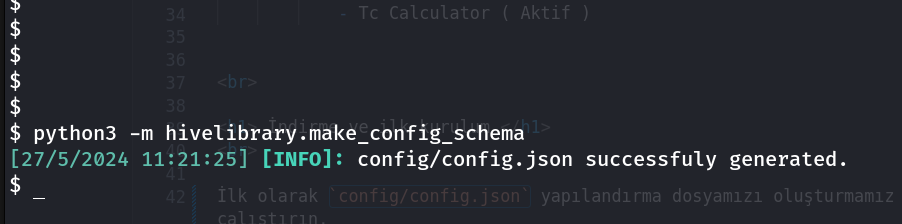

## 1) Config Dosyasını Oluşturma

İlk olarak `config/config.json` yapılandırma dosyamızı oluşturmamız gerekiyor. Bunun için proje klasörü içinde şu komutu çalıştırın.

```shell 
python3 -m hivelibrary.make_config_schema
```

Eğer aşşağıdaki gibi bir sonuç aldıysanız başarıyla oluşturulmuştur.




## 2) Kurulumun başlatılması

Otomatik kurulum işletimini başlatmadan önce kullandığınız linux dağıtımı için `python3` , `python3-dev` , `python3-pip` 'i kurmanız gerekli.


Eğer paketleri kurduysanız otomatik kurulumu başlatabilirsiniz. Aşşağıdaki gibi.

NOT: Otomatik indirme sistemi `sudo` veya direk olarak `root` ile çalışmaz gerekli olduğu zaman sizden parola ister.

```shell
bash linux.sh --wizard
 ```


Kurulum tamamlandığı zaman otomatik olarak TheHive açılacaktır. 


## 3) Kurulum sonrası elle başlatma


```shell
python3 main.py
```


<br>